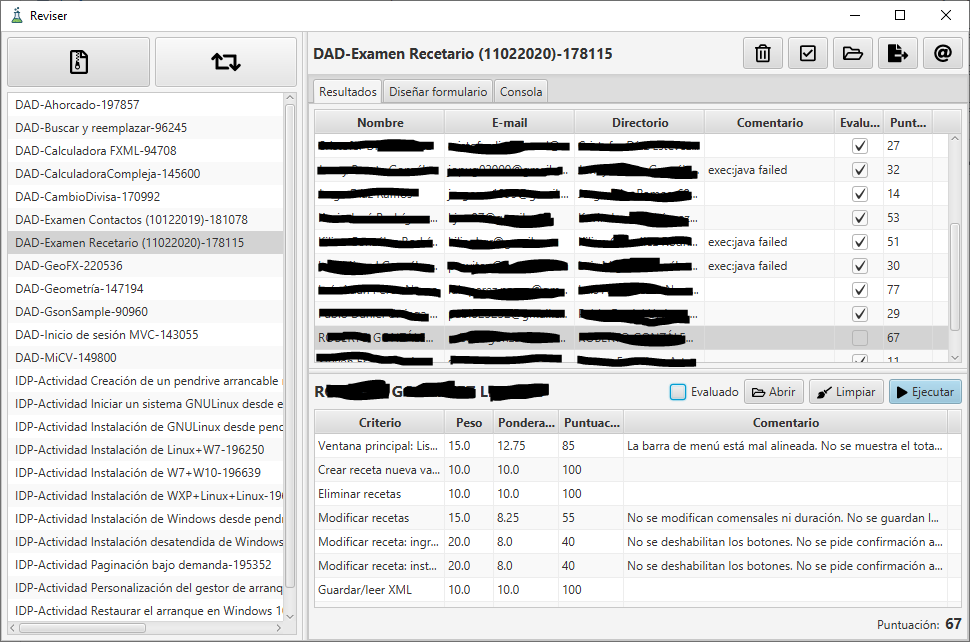

# Reviser 

Asistente para la corrección de actividades entregadas a través de un aula virtual Moodle, que permite:

- Ejecutar proyectos Maven o abrir otro tipo de entregas (documentos de texto, imágenes, ...) con la aplicación asociada disponible en nuestro equipo. 

> Funciona tanto si la entrega ha sido la URL del repositorio Git del proyecto o se ha subido un fichero comprimido (ZIP, RAR* o 7Z) conteniendo la carpeta del proyecto.

- Definir los criterios de calificación así como calificar los proyectos de forma sencilla. 

- Exportar las calificaciones en un fichero CSV con las notas que puede luego importarse a Moodle.

> \* *:warning: RAR: sólo soportada hasta la versión 4*

## Descargas

Puede descargar la aplicación desde el siguiente [enlace](https://github.com/fvarrui/Reviser/releases/latest).

## Atribuciones

Icono de la aplicación creado por [Dimitry Morilubov](https://www.flaticon.com/authors/dimitry-miroliubov) en [FlatIcon](https://www.flaticon.com/free-icon/flask_513972).

